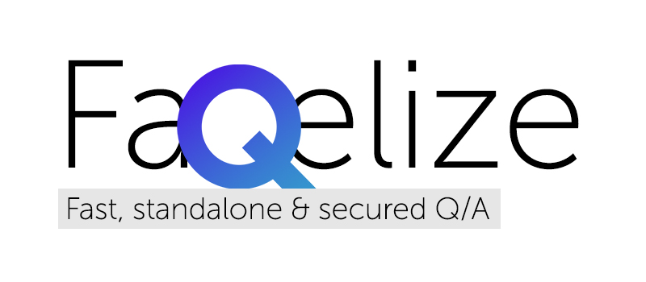

<center>
🖤 Try it out: <a href="https://ilyich.ru/Faqelize/" target="_blank">Faqelize Demo</a> with password: <code>1234</code>
</center>

иногда бывает что нужно сделать фак для закрытых целей.
но не хочется ставить докер или настраивать сервер.

## Files to setup
- ./**faqelize.config.js**
- ./src/i18n/**{language_code}.js**
- ./public/**database.json**

## Project setup
```
npm install
```

### Compiles and hot-reloads for development
```
npm run serve
```

### Compiles and minifies for production
```
npm run build
```
